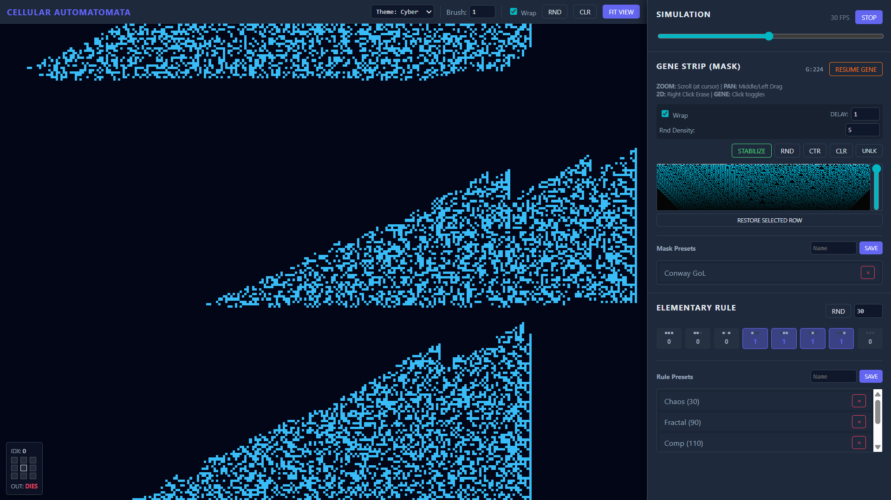

# Cellular Automatomata: Compositional Cellular Automata Simulator

This project is a browser-based simulator for a hybrid cellular automata system. It features a main **2D World** (similar to Conway's Game of Life) whose evolution is dictated by a dynamic **1D Elementary Cellular Automaton (ECA) Rule Strip**.

## ✨ Features

* **Hybrid Simulation:** The 2D World's next state is calculated using a 9-cell neighborhood, which is mapped to a state in the 1D Rule Strip (Mask).
* **Elementary Rule Editor:** Full control over the 8-bit Wolfram Elementary Cellular Automata rule (0-255).
* **Dynamic Rule Strip (Mask):** The 1D strip itself is a running ECA simulation, serving as the lookup table (mask) for the 2D World.
* **Interactive Painting:** Draw, erase, and zoom directly on both the 2D World and the 1D Rule Strip.
* **History & Inspection:** View the history of the 1D Rule Strip's evolution (Wolfram-style plot) and inspect the neighborhood of any cell in the 2D World.
* **Theming:** Switch between several visual themes (Cyber, Matrix, Magma, Paper).
* **Presets:** Save and load custom 1D Mask and ECA Rule presets.
* **Camera Control:** Pan and zoom control for the main 2D World and the 1D Rule Strip.

## 🕹️ Controls

The simulator is highly interactive and relies on mouse and keyboard input for control and customization.

### 🌐 2D World (Main Canvas)

| Action | Control | Description |
| :--- | :--- | :--- |
| **Pan View** | Middle Mouse Button Drag or Left Click + `Space` Drag | Moves the viewport. |
| **Zoom** | Scroll Wheel (at cursor) | Zooms in/out of the grid. |
| **Draw Alive** | Left Click / Left Drag | Paints cells as **Alive** (`1`). |
| **Draw Dead** | Right Click / Right Drag | Paints cells as **Dead** (`0`). |
| **Brush Size** | Numeric Input in Header | Changes the radius of the draw/erase brush. |
| **Inspect** | Mouse Hover | Shows the neighborhood pattern, its 9-bit index, and the resulting state (LIVES/DIES) from the current 1D Rule Strip (Mask). |

### 🧬 Gene Strip (1D Mask Canvas)

| Action | Control | Description |
| :--- | :--- | :--- |
| **Toggle Cell** | Left Click / Left Drag | Toggles the state (`1` or `0`). The initial click sets the draw mode (Draw or Erase) for the entire drag operation. |
| **Force Alive** | Left Click / Drag + `Shift` | Locks the cell state to **Alive** (`1`) (Green Lock). |
| **Force Dead** | Left Click / Drag + `Alt` or `Ctrl` | Locks the cell state to **Dead** (`0`) (Red Lock). |
| **Restore** | Click `Restore Selected Row` | Overwrites the current Rule Strip with the state from the selected historical row. |
| **History View** | Vertical Slider (right side) | Moves the view to a past generation of the 1D evolution. |

### ⚙️ Control Panel

* **Simulation Speed:** Adjust the `speedRange` slider to change the FPS of the 2D World update.
* **Pause/Stop:** Toggles the evolution of the **2D World**.
* **Gene Delay:** Controls how many 2D World updates occur before the **1D Rule Strip** evolves one step.
* **Elementary Rule:** Directly click on the `bit-val` (the output of the rule for that pattern) in the `Rule Grid` to toggle the rule bit, or use the number input (0-255).

## 💡 System Overview

The simulator runs two interconnected cellular automata:

1.  **The 2D World ($W \times H$ Grid):**
    * Each cell is either **Alive (1)** or **Dead (0)**.
    * It uses a **Moore Neighborhood** (the 8 surrounding cells plus the center cell itself), resulting in $2^9 = 512$ possible neighborhood patterns.
    * The 9-bit pattern is converted into an index from 0 to 511.
    * The rule for the cell's next state is determined by looking up the value at this index in the **1D Rule Strip**.

2.  **The 1D Rule Strip (512 Cells):**
    * This array acts as the complete **Rule Mask** for the 2D World.
    * Its evolution is determined by a classic **Wolfram Elementary Cellular Automaton (ECA)** using a 3-cell neighborhood (Left, Center, Right).
    * The ECA rule is the 8-bit number defined by the `Elementary Rule` control (e.g., Rule 30, Rule 110).
    * This means the rule for the 2D world is constantly changing (unless the 1D strip is paused or reaches a stable state).

This coupling creates complex, emergent behaviors in the 2D World that are indirectly controlled by a simple 1D rule.

---

Created by Iniyan Kalaivanan
